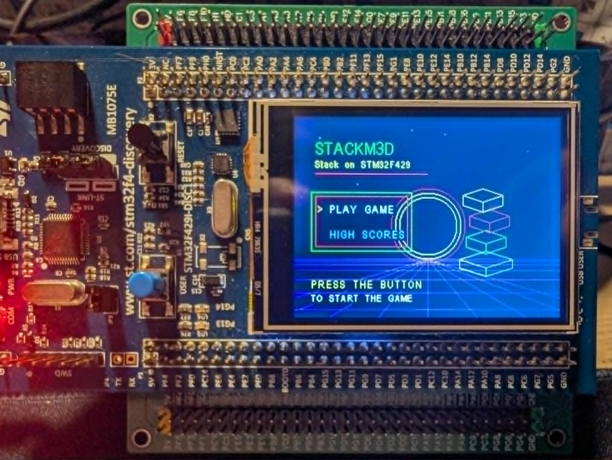

# STM32 Retro Play: Stack 3D & Tetris

A multi-game platform featuring a Stack 3D game, a classic Tetris game, and a custom software 3D renderer running on the STM32F429ZITx MCU. The firmware renders directly to a 320 x 240 ILI9341 display over SPI5, using both physical board button interrupts and a Bluetooth keyboard remote bridge for input.

## Demo

| Main Menu | Stack 3D Gameplay | Tetris Gameplay |
| :---: | :---: | :---: |
|  | [](docs/media/stack-3d-demo.mp4) |  |

*Click the Stack 3D image to play the video demo. (Images for Main Menu and Tetris are located in `docs/media/`).*

---

## Features

### 🕹️ Games
- **Stack 3D**:
  - A block moves along the X or Z axis (alternating after every successful placement).
  - Placing a block crops the overhanging section, splitting it into a falling piece accelerated downward by gravity.
  - Speed starts at `1.2 units/s`, increases by `0.08 units/s` per point, capped at `3.0 units/s`.
- **Classic Tetris**:
  - Full implementation of Tetris rules, featuring block rotation, wall kicks, line clearing, level progression, and classic scoring.

### 🌐 Wireless Remote Control
- Controlled wirelessly from any PC using a paired Bluetooth Serial bridge.
- **ESP32 Bridge**: The ESP32 acts as a raw byte-stream bridge, receiving character commands via Bluetooth and forwarding them to the STM32 over I2C (`0x08`).
- **Python Controller**: A PC-side script (`Others/bluetooth.py`) captures raw keyboard inputs instantly and transmits them via Bluetooth. It includes Windows Registry auto-detection to pair automatically with the `ESP32_Bridge_Logger`.

### 🎛️ Input Manager
- Decouples raw character commands (e.g. `w`, `a`, `s`, `d`, `1`) into logical game inputs (`INPUT_ACTION_MOVE_LEFT`, `INPUT_ACTION_MOVE_RIGHT`, etc.) through a unified `InputManager` module, guaranteeing consistent controller layouts across both games.

### 📐 Software Renderer
- CPU rasterizer written entirely in C for the Cortex-M4:
  - Model, view, and perspective projection matrices.
  - Isometric camera tracking through a look-at matrix.
  - Multi-object rendering against one shared Z-buffer.
  - Triangle back-face culling and depth-tested occlusion.
  - Flat per-face lighting in RGB565.
  - Chunked LCD output to save SRAM, with HUD text overlays composited directly into the output chunk.
  - Static raster scratch buffers with no per-frame heap allocation.

---

## Controls

### Remote Keyboard Controls (Bluetooth Serial)
| Action | Keyboard Key | Logical Action | Description |
| :--- | :--- | :--- | :--- |
| **Up / Rotate** | `W` / Arrow Up | `INPUT_ACTION_MOVE_UP` | Navigates menu up, rotates Tetris blocks |
| **Down / Drop** | `S` / Arrow Down | `INPUT_ACTION_MOVE_DOWN` | Navigates menu down, soft-drops Tetris blocks |
| **Left** | `A` / Arrow Left | `INPUT_ACTION_MOVE_LEFT` | Navigates menu left, shifts Tetris blocks left |
| **Right** | `D` / Arrow Right | `INPUT_ACTION_MOVE_RIGHT` | Navigates menu right, shifts Tetris blocks right |
| **Select / Action** | `Space` / `Enter` / `1` | `INPUT_ACTION_SELECT` | Triggers selection, drops Stack blocks, hard-drops Tetris blocks |

### Physical Controls (STM32 Board)
- **PA0 User Button**: Debounced active-high EXTI interrupt mapped to `INPUT_ACTION_SELECT`.

---

## Project Structure

```text
Core/
├── Inc/
│   ├── Display/        - ILI9341 LCD drivers, font configurations
│   ├── Communication/  - I2C driver (espi2c.h) and InputManager (input_manager.h)
│   ├── Graphics/       - 2D line/circle drawing & 3D software rasterizer (graphics_2d.h, graphics_3d.h)
│   └── Games/          - Games logic and AppStateManager (app_state_manager.h, tetris_game.h, stack_game.h)
├── Src/
│   ├── Display/        - Display driver and font rendering implementation
│   ├── Communication/  - espi2c and InputManager implementation
│   ├── Graphics/       - Rasterizer and graphics math implementation
│   ├── Games/          - Game loops, state rendering, and input routing
│   └── main.c          - System clock, peripheral initialization, and main loop
Others/
├── bluetooth.py        - Python console utility to stream raw keypresses via Bluetooth Classic (RFCOMM)
└── esp32sketch/        - Arduino sketch for the ESP32 Bluetooth-to-I2C bridge
```

---

## Hardware Configuration

| Component | Port / Pin | Connection |
| :--- | :--- | :--- |
| **MCU** | STM32F429ZIT6 | Target controller |
| **Display** | ILI9341 (320x240) | Landscape LCD |
| **SPI Clock** | `PF7` | `SPI5_SCK` |
| **SPI Data** | `PF9` | `SPI5_MOSI` |
| **LCD CS** | `PC2` | Chip Select |
| **LCD D/C** | `PD13` | Data / Command select |
| **LCD Reset** | `PD12` | Reset control |
| **User Button** | `PA0` / `EXTI0` | Active-high on-board button |
| **I2C SCL** | `PB6` | `I2C1_SCL` (connected to ESP32 pin 22) |
| **I2C SDA** | `PB7` | `I2C1_SDA` (connected to ESP32 pin 21) |
| **USART1 TX** | `PA9` | UART Debug Transmit |
| **USART1 RX** | `PA10` | UART Debug Receive |

*Note: I2C operates in Slave mode on the STM32 with address `0x08` (OwnAddress 16).*

---

## Build and Flash

### Requirements
- **STM32CubeIDE** with the GNU Tools for STM32 toolchain.
- An **ST-LINK** programmer/debug probe.
- An **ESP32 development board** (for wireless keyboard bridge).

### Steps
1. Open STM32CubeIDE.
2. Select **File > Import > General > Existing Projects into Workspace**.
3. Choose this repository as the project root and import `stm3d`.
4. Select the `Debug` build configuration and run **Project > Build Project**.
5. Connect your board via ST-LINK and choose **Run > Debug As > STM32 C/C++ Application**.
6. (Optional) Compile and upload the sketch in `Others/esp32sketch/` to your ESP32. Pair the ESP32 (named `ESP32_Bridge_Logger`) with your PC, then run:
   ```bash
   python Others/bluetooth.py
   ```

---

## License

This project is licensed under the [GNU General Public License v3.0](LICENSE).
